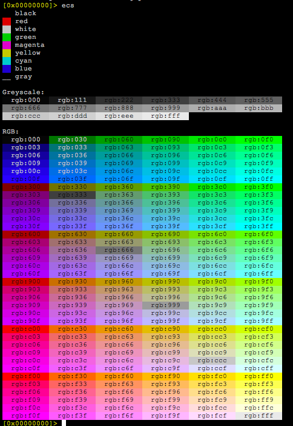

## Colors & Themes

The console access is encapsulated in an API that enables displaying the output of any command in ANSI, Win32 Console, or HTML formats. This functionality enables rizin to operate within environments with restricted display capabilities, such as kernels or embedded devices. You can still receive data from it in your preferred format.

The color option is referred to as `scr.color` and can be modified using the `e` command. The `scr.color` option offers support for four values:
- `e scr.color=0`: no colors (black and white)
- `e scr.color=1`: ANSI colors (16 basic ANSI colors)
- `e scr.color=2`: 256 colors (256 scale colors)
- `e scr.color=3`: truecolor (24bit true color)

To change color support by default, include a corresponding configuration option in the `rizinrc` [initial script](initial_scripts.md).

For example:

```bash
# enable truecolor
$ echo "e scr.color=3" >> ~/.rizinrc
```

The inclusion of user-defined options is necessary because there is no standardized or portable method for terminal programs to inquire about the console for optimal configurations. This also applies to charset encodings, so Rizin allows manual selection.

Typically, serial consoles may function well with options `0` (no colors) or `1` (ANSI), while more moderns terminals might support up to `3` (truecolor).

Rizin will attempt to discover the closest color scheme for your theme when selecting a theme using the `eco` command.

It is feasible to configure the color of nearly any element in the disassembly output. For UNIX-like terminals, Rizin accepts color specifications in `RGB` format. To alter the console color palette, use the `ec` command.

- Type `ec` to get a list of all currently used colors.
- Type `ecs` to display a color palette to pick colors.
- Type `ecr` to randomize the color palette.



## Themes

You have the option to craft your custom color theme, although Rizin comes with its predefined ones. Utilize the `eco` command to view or choose from them (`eco <theme name>`).

In visual panel mode (command `V`), you can switch themes by pressing `R` (`Shift + R`, or uppercase R). If you enable `scr.randpal` by setting it to `true`, you can randomize the palette similar to what `ecr` does.
