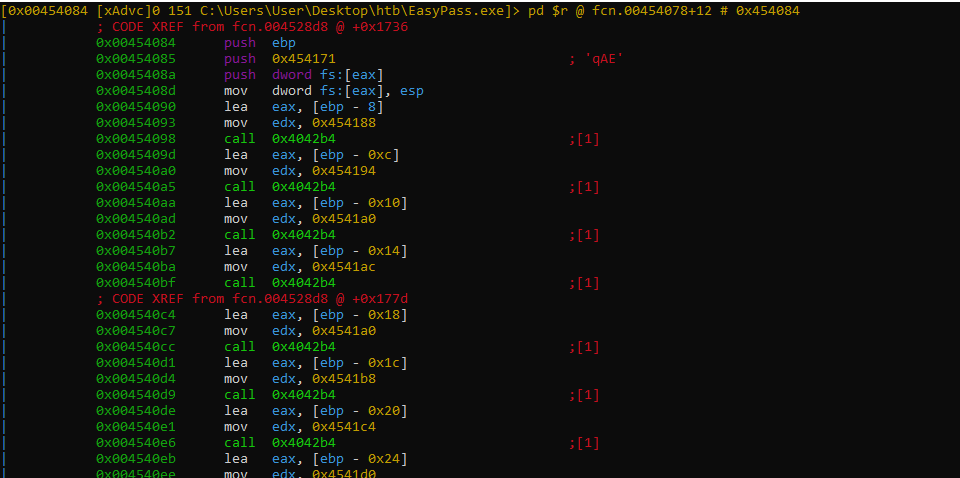
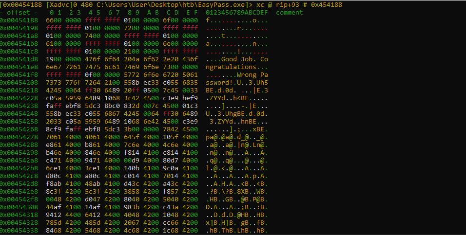
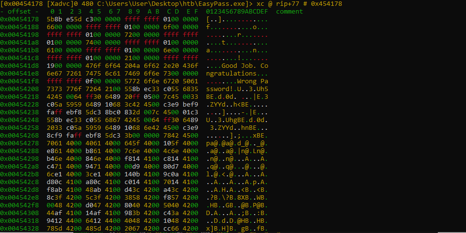

# Bonus

In the previous pages, we found out the the right password.
Now, we can figure out whether it is calculated at runtime or
hard-coded into the binary.

To do this, we will look at what happens from the
beginning of the current function from the
address `0x00454084`.

As a first, we'll go to the address `0x00454084`.



Take a break and observe the assembly code.
You will see a repeating code sequence :

```assembly
mov eax, [ebp - X] ; or X is between 0x8 and 0x24
mov edx, Y ; or Y is between 0x00454188  and 0x004541d0
```


Look the address `0x00454188`.





Pay attention to the previous picture. You can see the password
broken down letter by letter.

We can see that the routine is concatenating each letter into a string and compares
it to a user input.
