# Find the validation routine

The "Wrong Password!" string is located at `0x00454200` in the CODE section.

In this step, we wish to find the password, our approach will be to debug
the program based on the information already collected.

```bash
Spawned new process with pid 8556, tid = 8576
= attach 8556 8576
bin.baddr 0x00400000
Using 0x400000
asm.bits 32
```

> ```bash
> [0x7ffeaa1c2630]> iz~Wrong
> [0x7ffeaa1c2630]> izz~Wrong
> 5483 0x00053600 0x00454200 15  16   CODE    ascii   Wrong Password!
> ```
> ***rizin tips:*** We know where is located the "Wrong Password!" at
> `0x00454200` in the CODE section.
> To do the same research, we can use the `iz` and `izz`


`~` is Rizin's built-in `grep` command which you can use to filter the
output.
Here, we've searched for the word "Wrong" in the strings of the data
section.

Seeking to `0x00454200`- the location of the string:

```bash
[0x7ffeaa1c2630]> s 0x00454200

[0x00454200]> aaaa
```

We will ask rizin to analyze the program with `aaa`.

```bash
[0x00454200]> aaaa
[x] Analyze all flags starting with sym. and entry0 (aa)
[Warning: Invalid range. Use different search.in=? or analysis.in=dbg.maps.x
Warning: Invalid range. Use different search.in=? or analysis.in=dbg.maps.x
[x] Analyze function calls (aac)
[x] Analyze len bytes of instructions for references (aar)
[x] Check for classes
[TOFIX: aaft can't run in debugger mode.ions (aaft)
[x] Type matching analysis for all functions (aaft)
[x] Propagate noreturn information
[x] Use -AA or aaaa to perform additional experimental analysis.
[Warning: Invalid range. Use different search.in=? or analysis.in=dbg.maps.x
[x] Finding function preludes
[x] Enable constraint types analysis for variables
```

```bash
[0x00454200]> V
```

> ***rizin tips:*** The `V` command triggers the visual mode.

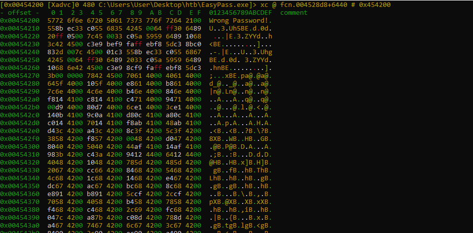

Press `p` command to switch on the code view.

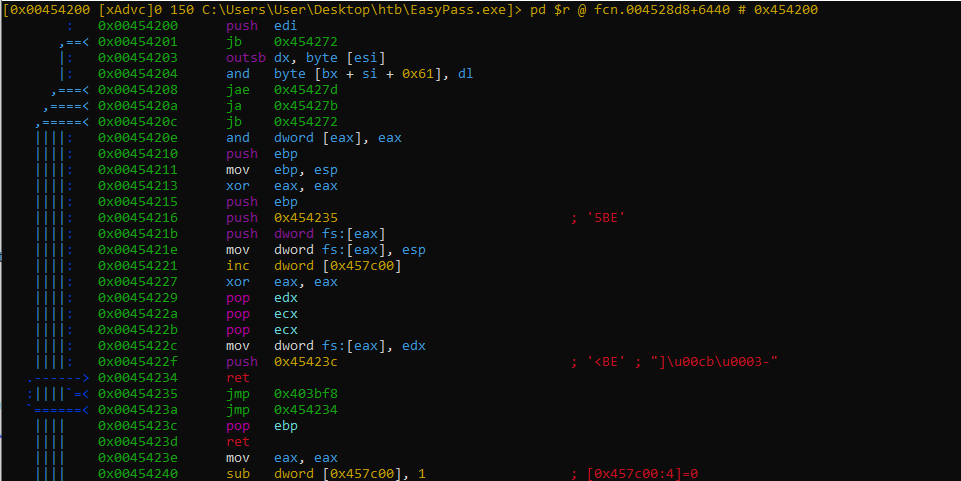

Press `x` to display the cross-references.

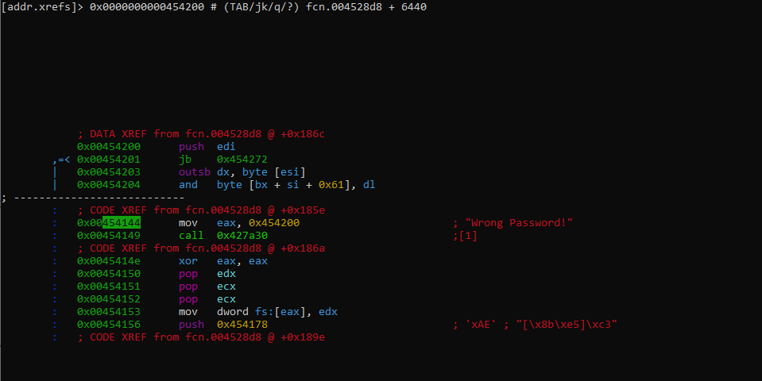

Press `enter` or `return` to jump of this reference.

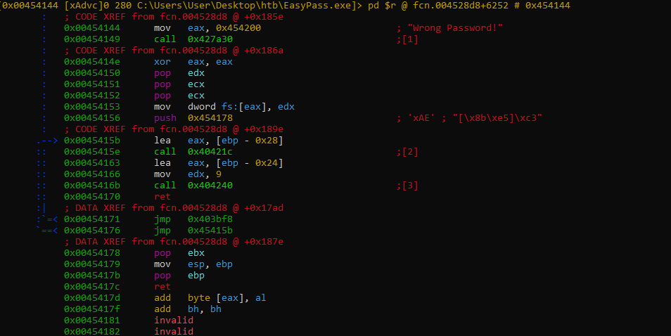

Rizin allows you to have a graph view by pressing the `space bar`.

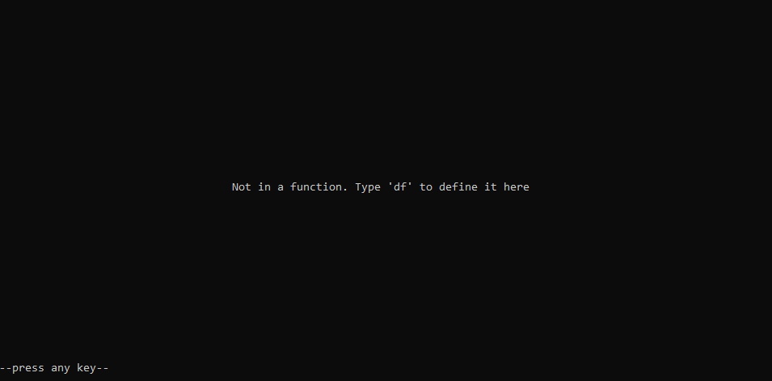

For the graph view to work here, rizin needs a function to be analyzed,
we will help him by creating it from the beginning of the function
where the string "Wrong Password!".

Scroll up to the address `0x00454078`.

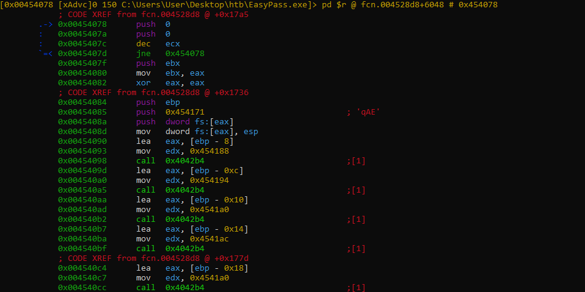

Press `d` and `f` to analyze the function.


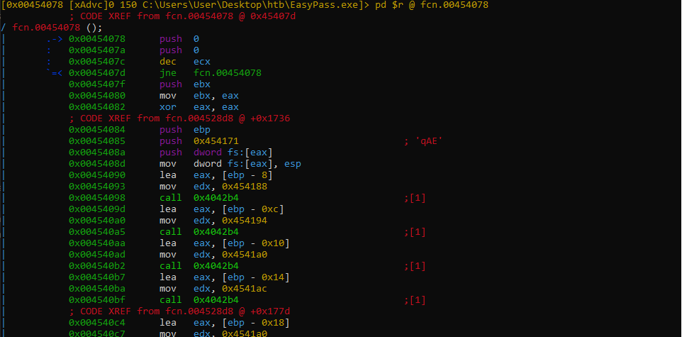

Now if you press the `space bar` the graph will be displayed.

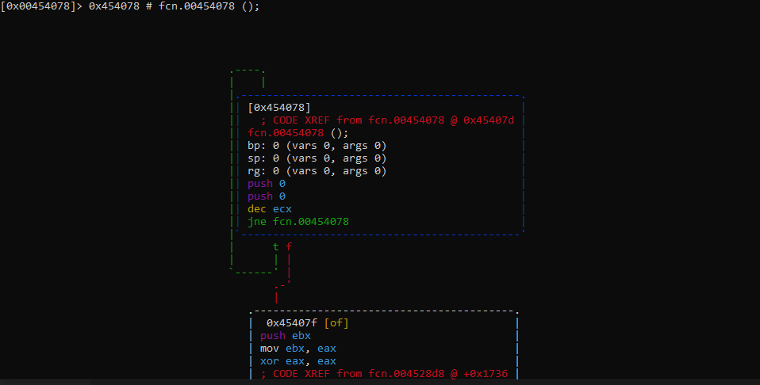

> ***rizin tips:*** to move around of graph, you can use the same keys like Vim:
> `h`, `j`, `k`, `l`.

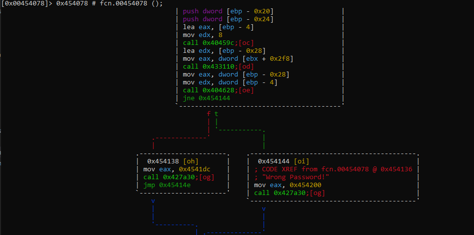

By deduction, the address `0x00427a30` is the function which popup the messagebox.

The right node, print the "Wrong Password!", the left one, probably prints the congratulations message.

At `0x00404628` is what which looks like a validation function because it is
followed by a conditional test that either leads to the "Wrong Password!" message
or the congratulation message.

Press `g` and enter the address `0x004041dc` to check if this one is the
congratulation message.

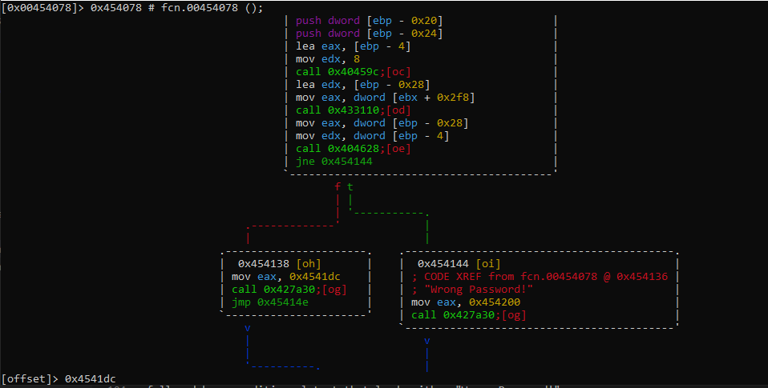

Press `n` to ignore the create function message and press `P`.

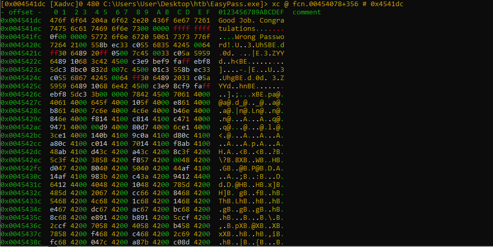

Press `x` and `p`.

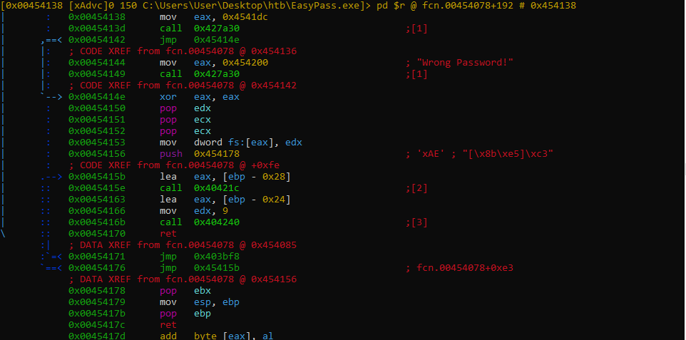

Press `;` to enter a comment:

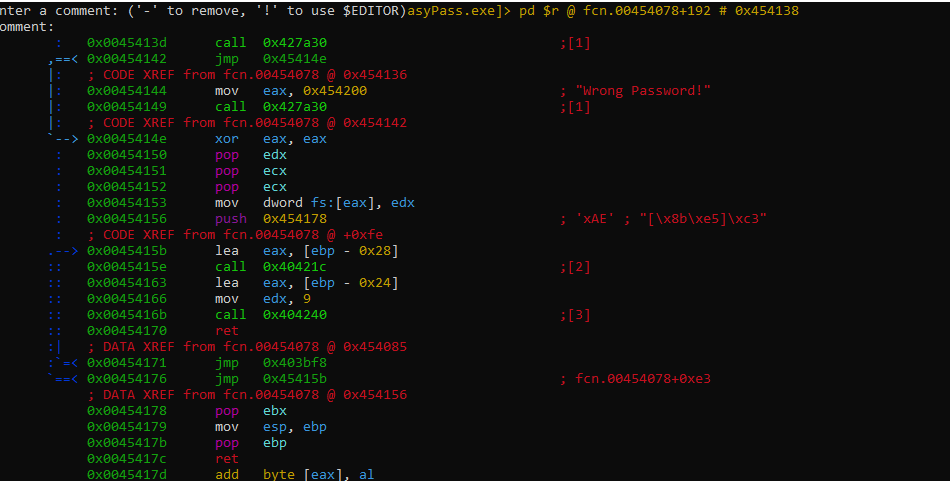

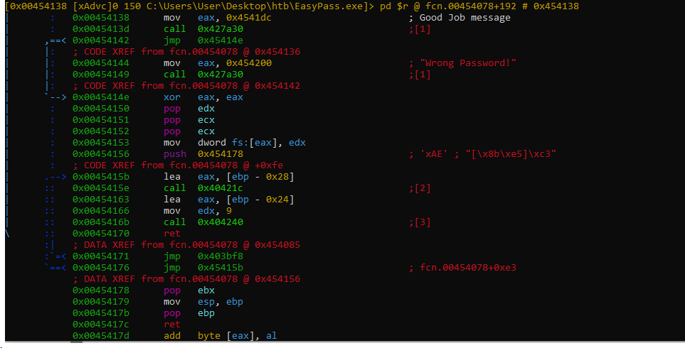

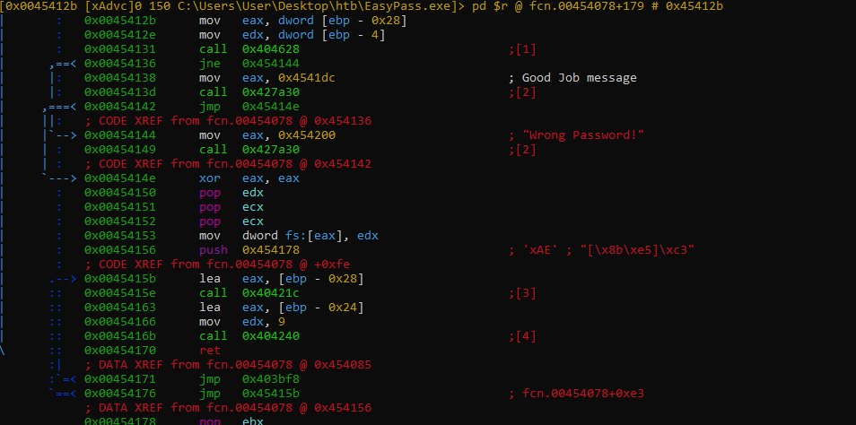


