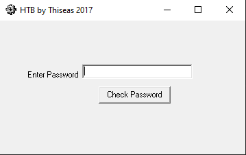
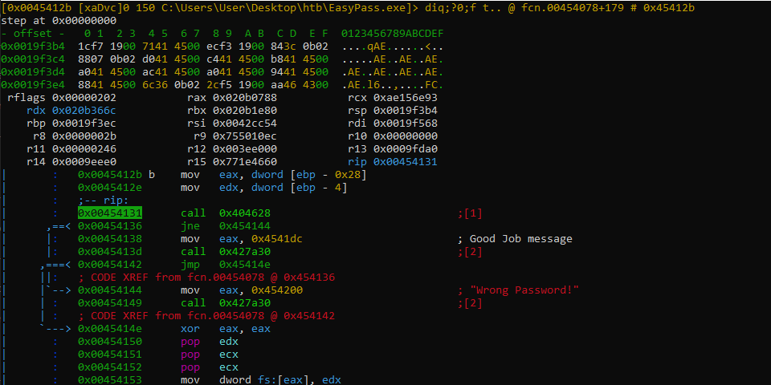

# Fire up the debugger

The next step will be to put a breakpoint at `0x0045412b`,
this address contains probably the right password or our.
Press `F2` key to put a breakpoint.

Press `:` , `d` and `c` to run `EasyPass.exe`.

Press `:` , `d` and `c` or `F9` key.

Press `:` , `d` and `c` or `F9` key.

The program is launched.

Enter a placeholder text and click on the "Check Password" button.

Logically, the program should stop at our breakpoint point.

Press `q` and then `p` to show the debugger view panel.

Press `F8` key to step over.

Press `g`, enter `eax` and `P` twice.

That's great our placeholder text is in memory.

Press `p` twice, `g` and enter `rip`.

Press `F8` key.

Press `g`, enter `edx` and `P` twice.

The right password seems to be **fortan!**.

Press `p` twice, `g` and enter `rip`.

Press `F8` key twice.

The call at `0x0045413d` seems to compare the previous password and 
when unequal, the program jumps to the "Wrong Pasword!" message.

Press `F9` key to show the message box.

After that, enter "fortan!" string and repeat the previous step until
the address `0x0045413d`.

Press `F8`key twice.

it's seems all right ! Press `F9` key to confirm this fact.

