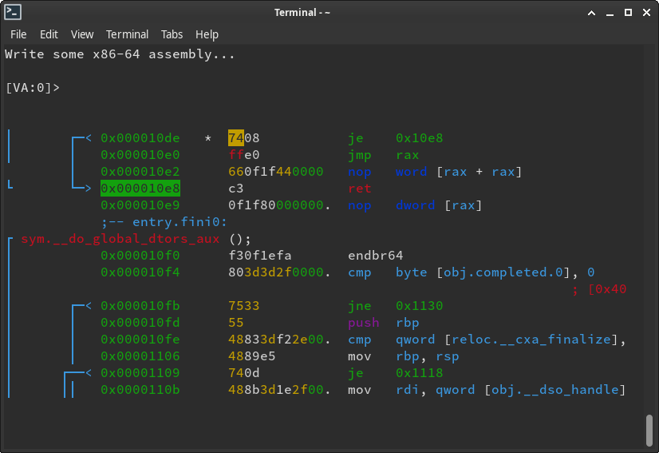
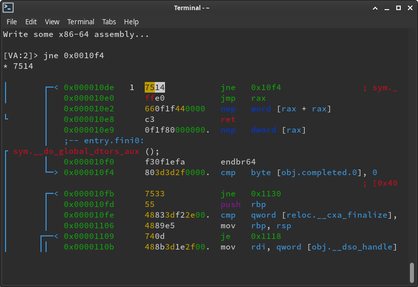

# Visual Assembler

You can use Visual Mode to assemble code (patch) using `A`.
For example, let's `xor` the EAX register instead of EBP register, here.
To assemble, seek to the location you want to patch and press `A`.

Notice the preview of the disassembly and arrows. After assembling the instruction,
you can see that the branch reference lines have been changed, and it is now pointing to 
the offset of the newly assembled `jne` instruction:

You need to open the file in writing mode (`rizin -w` or `oo+`) in order to patch the file.
You can also use the cache mode: `e io.cache=true` and `wc?`.

Remember that patching files in debug mode only patches the memory, not the file.
